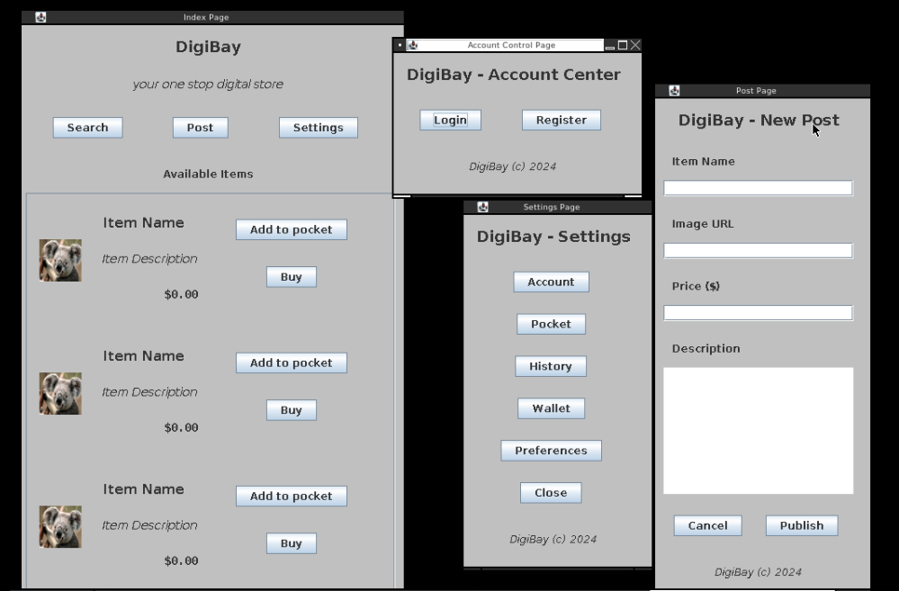

# Description

This repo contains the source code, assets and Makefile for the e-commerce app for ITE104

It uses Java AWT/Swing, with a layer of abstraction to make coding the UI easier and more consistent.



# Building
**java** and **javac** must be installed.
**make** is optional to make compiling easier.

Using **make**:

type

```bash
make
```

or 

```bash
make build
make run
```

This will build and run the project.

The first method cleans the build files after the program exits. Using the second methods means you need to manually clean them.

To clean the generated files:

```bash
make clean
```

If "make" is not installed, then just type the commands manually. The Makefile contains the necessary commands

